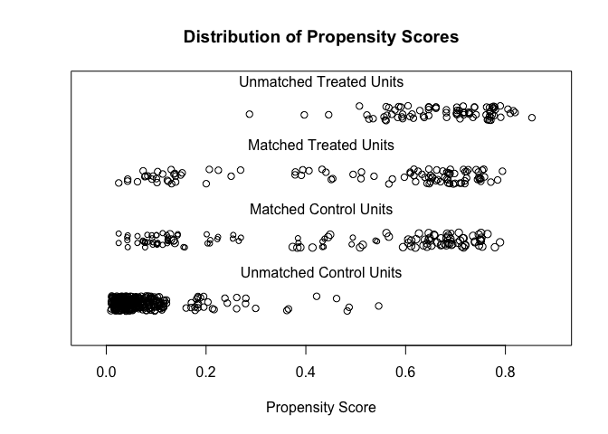
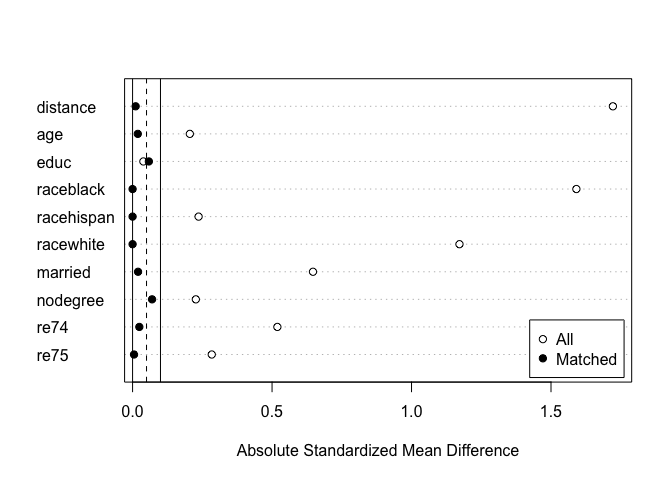

<!-- README.md is generated from README.Rmd. Please edit that file -->

# MatchIt: Nonparametric Preprocessing for Parametric Causal Inference

[](https://travis-ci.org/kosukeimai/MatchIt)
[](https://cran.r-project.org/package=MatchIt)


`MatchIt` provides a simple and straightforward interface to various
methods of matching for covariate balance in observational studies.
Matching is one way to reduce confounding and model dependence when
estimating treatment effects. Several matching methods are available,
including nearest neighbor matching, optimal pair matching, optimal full
matching, genetic matching, exact matching, coarsened exact matching,
and subclassification, some of which rely on functions from other R
packages. A variety of methods to estimate propensity scores for
propensity score matching are included. Below is an example of the use
of `MatchIt` to perform nearest neighbor propensity score matching with
replacement and assessing overlap and balance:

``` r
library("MatchIt")
data("lalonde", package = "MatchIt")

#Nearest neighbor PS matching with replacement
m.out <- matchit(treat ~ age + educ + race + married + nodegree +
                     re74 + re75, data = lalonde, replace = TRUE)
```

Printing the `MatchIt` object provides details of the kind of matching
performed.

``` r
print(m.out)
```

    #> 
    #> Call: 
    #> matchit(formula = treat ~ age + educ + race + married + nodegree + 
    #>     re74 + re75, data = lalonde, replace = TRUE)
    #> 
    #> Sample sizes:
    #>           Control Treated
    #> All           429     185
    #> Matched        80     185
    #> Unmatched     349       0
    #> Discarded       0       0

We can view propensity score overlap and see which observations were
matched and unmatched using a jitter plot:

``` r
#Checking for PS overlap
plot(m.out, type = "jitter", interactive = FALSE)
```



With this we can see that most of the unmatched control units had small
propensity scores, making them unlike the treated group. Control units
with higher propensity scores were matched to multiple treated units as
indicated by their larger circles in the plot. Other plots are available
to view the distributions of propensity scores and covariates.

We can check covariate balance for the original and matched samples
using `summary()`:

``` r
#Checking balance before and after matching:
summary(m.out)
```

    #> 
    #> Call:
    #> matchit(formula = treat ~ age + educ + race + married + nodegree + 
    #>     re74 + re75, data = lalonde, replace = TRUE)
    #> 
    #> Summary of balance for all data:
    #>            Means Treated Means Control Std. Mean Diff. eCDF Med eCDF Mean eCDF Max
    #> distance          0.5774        0.1822          1.7219   0.3964    0.3774   0.6444
    #> age              25.8162       28.0303         -0.2053   0.0827    0.0813   0.1577
    #> educ             10.3459       10.2354          0.0387   0.0228    0.0347   0.1114
    #> raceblack         0.8432        0.2028          1.5910   0.6404    0.6404   0.6404
    #> racehispan        0.0595        0.1422         -0.2366   0.0827    0.0827   0.0827
    #> racewhite         0.0973        0.6550         -1.1719   0.5577    0.5577   0.5577
    #> married           0.1892        0.5128         -0.6467   0.3236    0.3236   0.3236
    #> nodegree          0.7081        0.5967          0.2268   0.1114    0.1114   0.1114
    #> re74           2095.5737     5619.2365         -0.5190   0.2335    0.2248   0.4470
    #> re75           1532.0553     2466.4844         -0.2838   0.1355    0.1342   0.2876
    #> 
    #> 
    #> Summary of balance for matched data:
    #>            Means Treated Means Control Std. Mean Diff. eCDF Med eCDF Mean eCDF Max
    #> distance          0.5774        0.5765          0.0042   0.0000    0.0030   0.0486
    #> age              25.8162       24.1027          0.1589   0.0351    0.0766   0.3405
    #> educ             10.3459       10.3784         -0.0114   0.0108    0.0216   0.0595
    #> raceblack         0.8432        0.8378          0.0134   0.0054    0.0054   0.0054
    #> racehispan        0.0595        0.0649         -0.0155   0.0054    0.0054   0.0054
    #> racewhite         0.0973        0.0973          0.0000   0.0000    0.0000   0.0000
    #> married           0.1892        0.1297          0.1188   0.0595    0.0595   0.0595
    #> nodegree          0.7081        0.7027          0.0110   0.0054    0.0054   0.0054
    #> re74           2095.5737     2336.4629         -0.0355   0.0108    0.0406   0.2162
    #> re75           1532.0553     1503.9290          0.0085   0.0324    0.0680   0.2378
    #> 
    #> Percent Balance Improvement:
    #>            Std. Mean Diff. eCDF Med eCDF Mean eCDF Max
    #> distance              99.8    100.0      99.2     92.5
    #> age                   22.6     57.5       5.8   -115.9
    #> educ                  70.7     52.5      37.7     46.6
    #> raceblack             99.2     99.2      99.2     99.2
    #> racehispan            93.5     93.5      93.5     93.5
    #> racewhite            100.0    100.0     100.0    100.0
    #> married               81.6     81.6      81.6     81.6
    #> nodegree              95.1     95.1      95.1     95.1
    #> re74                  93.2     95.4      81.9     51.6
    #> re75                  97.0     76.1      49.3     17.3
    #> 
    #> Sample sizes:
    #>           Control Treated
    #> All           429     185
    #> Matched        80     185
    #> Unmatched     349       0
    #> Discarded       0       0

At the top is balance for the original sample. Below that is balance in
the matched sample, followed by the percent reduction in imbalance and
the sample sizes before and after matching. Smaller values for the
balance statistics indicate better balance. We can plot the standardized
mean differences in a Love plot for a clean, visual display of balance
across the sample:

``` r
#Plot balance
plot(summary(m.out))
```



Although much has been written about matching theory, most of the theory
relied upon in `MatchIt` is described well in [Ho, Imai, King, and
Stuart (2007)](https//:doi.org/10.1093/pan/mpl013) and [Stuart
(2010)](https://doi.org/10.1214/09-STS313). The *Journal of Statistical
Software* article for `MatchIt` can be accessed
[here](https://doi.org/10.18637/jss.v042.i08), though note that some
options have changed, so the `MatchIt` reference pages should be used
for understanding the functions and methods available. Further
references for individual methods are present in their respective help
pages.

Please cite `MatchIt` when using it for analysis presented in
publications, which you can do by citing the *Journal of Statistical
Software* article below:

Ho, D. E., Imai, K., King, G., & Stuart, E. A. (2011). MatchIt:
Nonparametric Preprocessing for Parametric Causal Inference. *Journal of
Statistical Software*, 42(8).
[doi:10.18637/jss.v042.i08](https://doi.org/10.18637/jss.v042.i08)

This citation can also be accessed using `citation("MatchIt")` in R. For
reproducibility purposes, it is also important to include the version
number for the version used.
