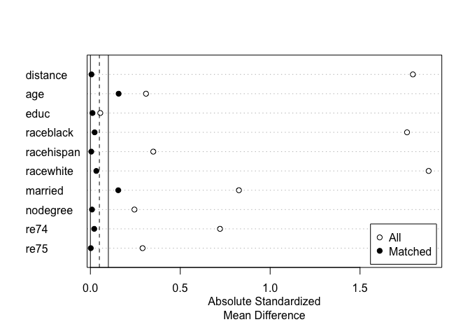

<!-- README.md is generated from README.Rmd. Please edit that file -->

# MatchIt: Nonparametric Preprocessing for Parametric Causal Inference 

## [](https://cran.r-project.org/package=MatchIt) [](https://cran.r-project.org/package=MatchIt)

### Overview

`MatchIt` provides a simple and straightforward interface to various
methods of matching for covariate balance in observational studies.
Matching is one way to reduce confounding and model dependence when
estimating treatment effects. Several matching methods are available,
including nearest neighbor matching, optimal pair matching, optimal full
matching, generalized full matching, genetic matching, exact matching,
coarsened exact matching, cardinality matching, and subclassification,
some of which rely on functions from other R packages. A variety of
methods to estimate propensity scores for propensity score matching are
included. Below is an example of the use of `MatchIt` to perform
Mahalanobis distance matching with replacement and assess balance:

``` r
library("MatchIt")
data("lalonde", package = "MatchIt")

# 1:1 nearest neighbor matching with replacement on 
# the Mahalanobis distance
m.out <- matchit(treat ~ age + educ + race + married + 
                   nodegree + re74 + re75, 
                 data = lalonde, distance = "mahalanobis",
                 replace = TRUE)
```

Printing the `MatchIt` object provides details of the kind of matching
performed.

``` r
m.out
```

    #> A matchit object
    #>  - method: 1:1 nearest neighbor matching with replacement
    #>  - distance: Mahalanobis
    #>  - number of obs.: 614 (original), 260 (matched)
    #>  - target estimand: ATT
    #>  - covariates: age, educ, race, married, nodegree, re74, re75

We can check covariate balance for the original and matched samples
using `summary()`:

``` r
#Checking balance before and after matching:
summary(m.out)
```

    #> 
    #> Call:
    #> matchit(formula = treat ~ age + educ + race + married + nodegree + 
    #>     re74 + re75, data = lalonde, distance = "mahalanobis", replace = TRUE)
    #> 
    #> Summary of Balance for All Data:
    #>            Means Treated Means Control Std. Mean Diff. Var. Ratio eCDF Mean eCDF Max
    #> age              25.8162       28.0303         -0.3094     0.4400    0.0813   0.1577
    #> educ             10.3459       10.2354          0.0550     0.4959    0.0347   0.1114
    #> raceblack         0.8432        0.2028          1.7615          .    0.6404   0.6404
    #> racehispan        0.0595        0.1422         -0.3498          .    0.0827   0.0827
    #> racewhite         0.0973        0.6550         -1.8819          .    0.5577   0.5577
    #> married           0.1892        0.5128         -0.8263          .    0.3236   0.3236
    #> nodegree          0.7081        0.5967          0.2450          .    0.1114   0.1114
    #> re74           2095.5737     5619.2365         -0.7211     0.5181    0.2248   0.4470
    #> re75           1532.0553     2466.4844         -0.2903     0.9563    0.1342   0.2876
    #> 
    #> Summary of Balance for Matched Data:
    #>            Means Treated Means Control Std. Mean Diff. Var. Ratio eCDF Mean eCDF Max Std. Pair Dist.
    #> age              25.8162       25.5622          0.0355     0.6540    0.0461   0.1838          0.4827
    #> educ             10.3459       10.4270         -0.0403     1.1635    0.0077   0.0378          0.1963
    #> raceblack         0.8432        0.8432          0.0000          .    0.0000   0.0000          0.0000
    #> racehispan        0.0595        0.0595          0.0000          .    0.0000   0.0000          0.0000
    #> racewhite         0.0973        0.0973          0.0000          .    0.0000   0.0000          0.0000
    #> married           0.1892        0.1784          0.0276          .    0.0108   0.0108          0.0276
    #> nodegree          0.7081        0.7081         -0.0000          .    0.0000   0.0000          0.0000
    #> re74           2095.5737     1788.6941          0.0628     1.5689    0.0311   0.1730          0.2494
    #> re75           1532.0553     1087.7420          0.1380     2.1220    0.0330   0.0865          0.2360
    #> 
    #> Sample Sizes:
    #>               Control Treated
    #> All            429.       185
    #> Matched (ESS)   32.94     185
    #> Matched         75.       185
    #> Unmatched      354.         0
    #> Discarded        0.         0

At the top is balance for the original sample. Below that is balance in
the matched sample, followed by the percent reduction in imbalance and
the sample sizes before and after matching. Smaller values for the
balance statistics indicate better balance. (In this case, good balance
was not achieved and other matching methods should be tried). We can
plot the standardized mean differences in a Love plot for a clean,
visual display of balance across the sample:

``` r
#Plot balance
plot(summary(m.out))
```



Although much has been written about matching theory, most of the theory
relied upon in `MatchIt` is described well in [Ho, Imai, King, and
Stuart (2007)](https//:doi.org/10.1093/pan/mpl013) and [Stuart
(2010)](https://doi.org/10.1214/09-STS313). The *Journal of Statistical
Software* article for `MatchIt` can be accessed
[here](https://doi.org/10.18637/jss.v042.i08), though note that some
options have changed, so the `MatchIt` reference pages and included
vignettes should be used for understanding the functions and methods
available. Further references for individual methods are present in
their respective help pages. The `MatchIt`
[website](https://kosukeimai.github.io/MatchIt/) provides access to
vignettes and documentation files.

### Citing `MatchIt`

Please cite `MatchIt` when using it for analysis presented in
publications, which you can do by citing the *Journal of Statistical
Software* article below:

Ho, D. E., Imai, K., King, G., & Stuart, E. A. (2011). MatchIt:
Nonparametric Preprocessing for Parametric Causal Inference. *Journal of
Statistical Software*, 42(8).
[doi:10.18637/jss.v042.i08](https://doi.org/10.18637/jss.v042.i08)

This citation can also be accessed using `citation("MatchIt")` in R. For
reproducibility purposes, it is also important to include the version
number for the version used.
